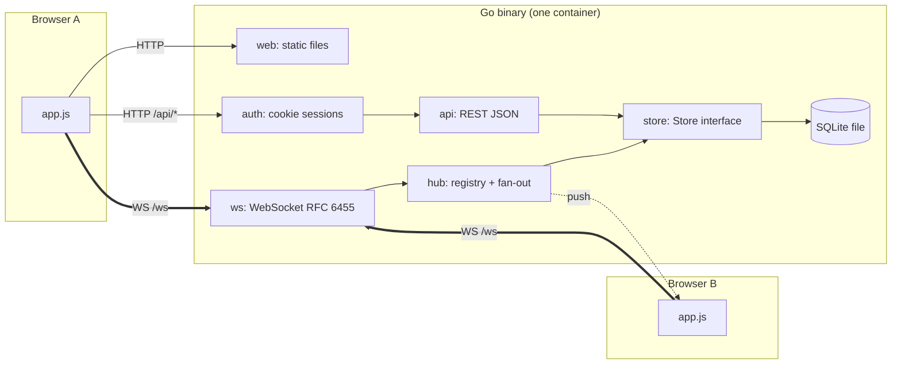
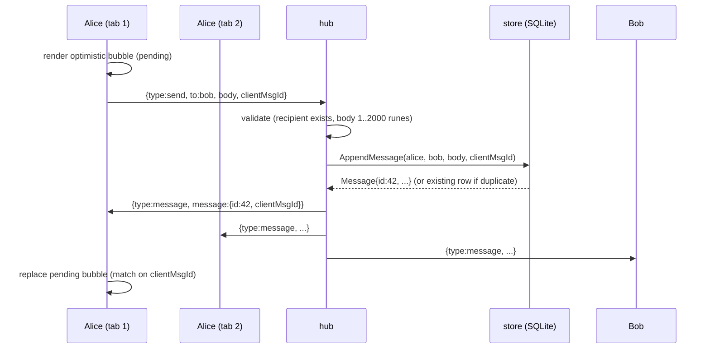
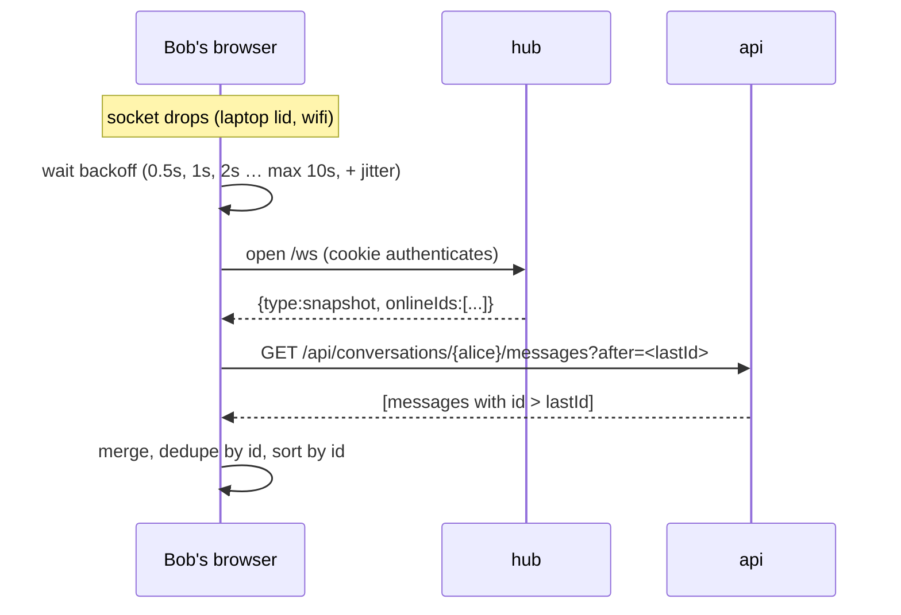

# Architecture

## In one paragraph (for a non-technical reader)

The app is a single small server program. When you open it in a browser and pick a
username, the browser opens a persistent two-way connection to the server (a *WebSocket*)
and keeps it open, so the server can push a message to you the instant somebody sends it —
no refreshing. Every message is written to a database file first, then pushed, so nothing
is ever shown that was not saved. If your connection drops, the browser reconnects on its
own and asks the server "what did I miss since message number N?".

## Components



| Package | Responsibility | Depends on |
|---|---|---|
| `cmd/server` | process lifecycle: config, signals, graceful shutdown | `app`, `config`, `store` |
| `internal/app` | wires everything into one `http.Handler` (shared by `main` and e2e tests) | all below |
| `internal/ws` | WebSocket handshake + frame codec, hand-written | stdlib only |
| `internal/hub` | who is connected, message validation, persist-then-fan-out, presence | `store`, `ws`, `auth` |
| `internal/store` | `Store` interface + SQLite implementation | `modernc.org/sqlite` |
| `internal/auth` | login/logout/me, session cookie, middleware | `store` |
| `internal/api` | contacts, history, request logging | `store`, `auth` |
| `web` | `index.html`, `app.js`, `style.css` embedded in the binary | — |

Dependency direction is strictly downward; `api` and `hub` never import each other
(`api` sees the hub through a one-method `Presence` interface).

## Sending a message



Key property: **persist before fan-out**. The database row is the source of truth; the push
is just a fast notification of something that already exists.

## Reconnect and resync



The client keeps `lastId` per conversation — the highest server-assigned message ID it has
seen. Because IDs are monotonic and assigned by the database, `after=<lastId>` is a cursor
that is always correct, even while new messages are being inserted.

## Delivery guarantees

| Direction | Guarantee | Mechanism |
|---|---|---|
| client → server | exactly-once *storage* | `clientMsgId` + `UNIQUE(sender_id, client_msg_id)`; a retry returns the original row |
| server → client (live) | at-most-once | push over the socket; nothing is queued for a dead socket |
| server → client (overall) | eventually complete | cursor resync on reconnect / open |
| ordering | total per conversation | database autoincrement ID; clients sort by it |

## WebSocket frame layout (what `internal/ws` parses)

```
 0               1               2               3
 0 1 2 3 4 5 6 7 8 9 0 1 2 3 4 5 6 7 8 9 0 1 2 3 4 5 6 7 8 9 0 1
+-+-+-+-+-------+-+-------------+-------------------------------+
|F|R|R|R| opcode|M| Payload len |    Extended payload length    |
|I|S|S|S|  (4)  |A|     (7)     |             (16/64)           |
|N|1|2|3|       |S|             |   (if payload len==126/127)   |
+-+-+-+-+-------+-+-------------+-------------------------------+
|     Masking-key (if MASK set)                                 |
+---------------------------------------------------------------+
|                     Payload Data (masked if MASK)              |
+---------------------------------------------------------------+
```

Supported: text (0x1), close (0x8), ping (0x9), pong (0xA), all three length forms,
mandatory client masking. Rejected with a close code: binary, fragmentation, RSV bits,
payloads over 64 KiB.

## Runtime

One container. The Go binary is statically linked and runs as non-root on a distroless
image. State lives in one SQLite file on a named volume (`chat-data`). `docker compose up`
is the whole deployment; `server -healthcheck` lets compose probe liveness without curl.
